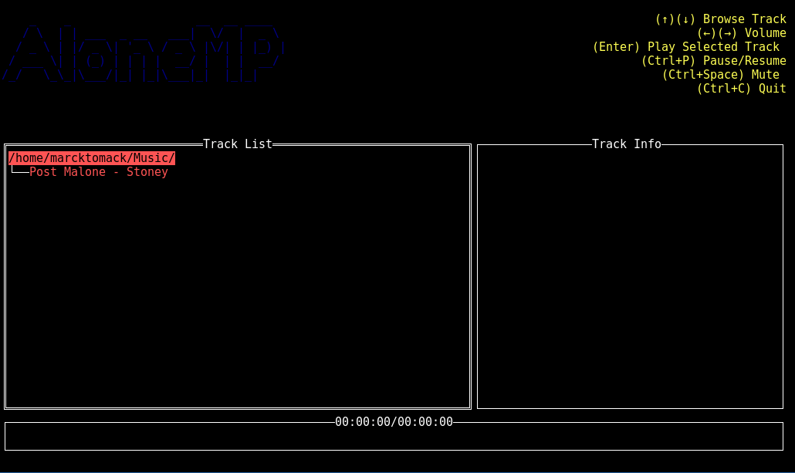

# aloneMP

A minimal music player terminal based.

aloneMP is composed of two elements, the daemon (aloneMPd) and the clients, for now is avaiable only the terminal client with a TUI



# Download and installation on Debian and friends

You need to have systemd.

Download the .deb package <a href="https://github.com/marcktomack/aloneMP/releases">here</a>

This enable the daemon and install aloneMP

There are also the zip with only the binary if you want to configure all the things manually

I will provide more packages and installation types.

# Usage

```
Usage of aloneMP:
  -addr string
        aloneMP daemon address (default "127.0.0.1:3777")
  -dir string
        Directory with audio files (default "~/Music")
  -srv string
        aloneMP daemon server type (default "tcp")
  -tui
        run tui client (default true)
  -version
        show version

```

You can pass a directory with audio files:

`aloneMP -dir /your/directory`

Or by default it will load audio files from `~/Music`

You need to provide the daemon server type and the address, the default one is 127.0.0.1:3777, same on the daemon

Docs for servers and servers it self is under construction

Supported formats are <b>MP3</b>, <b>FLAC</b>, <b>OGG</b> and <b>WAV</b>


